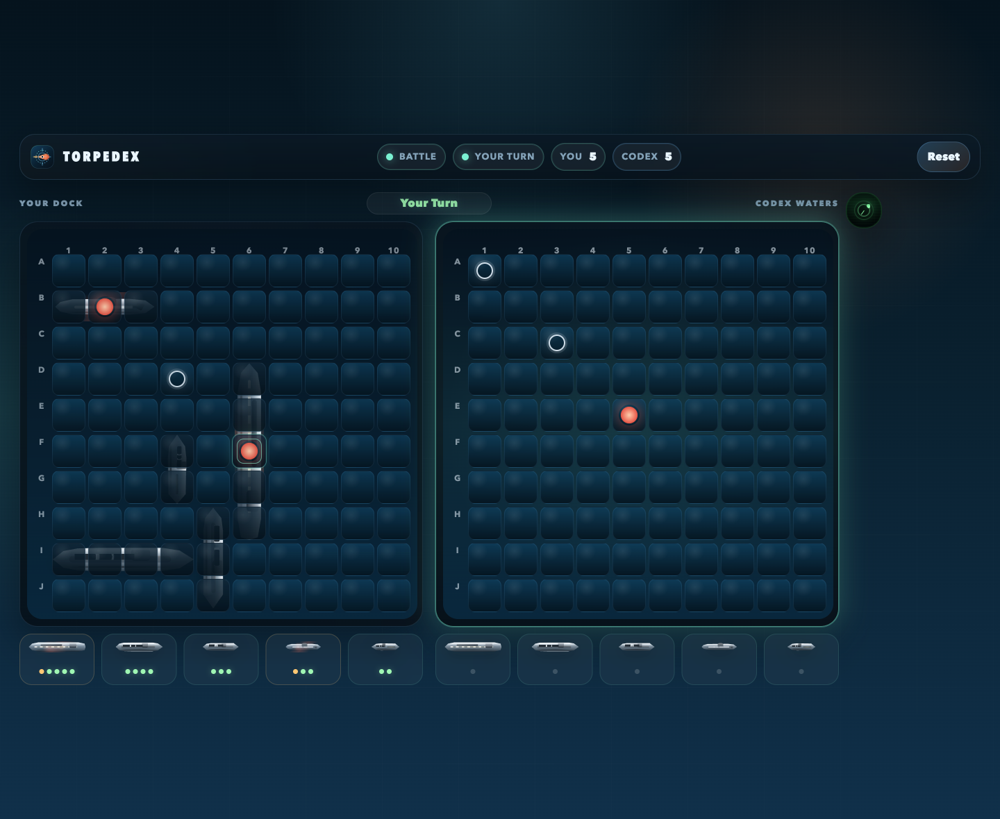

# Torpedex

Play Battleship against Codex in a live local match.

Torpedex is a small local game built around one simple loop: you play in the browser, Codex plays the other side, and the Codex session stays attached for the whole match instead of stopping after a single move.



## Paste This Into Codex

If you want the smoothest first-run experience, copy this into Codex:

```text
Let's play Torpedex! Use the latest https://github.com/petergpt/torpedex, read CODEX_INSTRUCTIONS.md, run `npm run codex:play`, tell me to open http://127.0.0.1:3197, and keep that one process running until I say stop. Do not inspect unrelated folders, run extra checks, open the browser yourself, create your own loop or fallback, or run workspace inspection commands like `pwd` or `ls` unless something is actually failing.
```

The same prompt also lives in [CODEX_PROMPT.md](./CODEX_PROMPT.md).

The detailed Codex playbook lives in [CODEX_INSTRUCTIONS.md](./CODEX_INSTRUCTIONS.md).

### Manual Option

If you would rather start the app yourself:

```bash
npm install && npm start
```

Then open [http://127.0.0.1:3197](http://127.0.0.1:3197), open this repo in Codex, and paste the prompt above.

## What Playing Feels Like

- The board usually opens ready to start.
- You click shots in the browser.
- Codex answers on its own turn.
- The session keeps going across multiple turns without you having to re-prompt it.

## Files You Care About

- [CODEX_PROMPT.md](./CODEX_PROMPT.md): the copy-paste starter prompt
- [CODEX_INSTRUCTIONS.md](./CODEX_INSTRUCTIONS.md): the detailed Codex setup and live-play instructions
- [server.js](./server.js): local web server
- [lib/game.js](./lib/game.js): game rules and state serialization

## For Tinkerers

If you want to verify the repo before playing:

```bash
npm test
```

The app itself is intentionally simple: one Node server, one browser UI, one structured live state endpoint, and one persistent Codex session.
